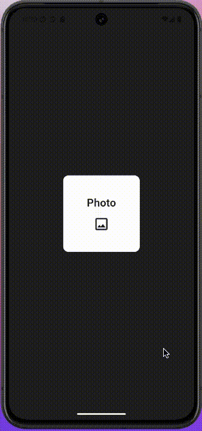
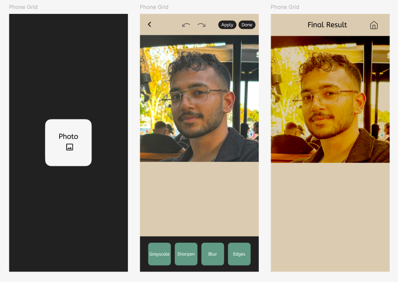

# Image-Filter-App
A simple Flutter app that runs image processing code natively using C++ for efficiency. Also includes a FastAPI backend to mock a cloud-based image processor.

<div style="text-align: center;">
  
  <p>Screen Recording</p>
</div>

<br/>

<div style="text-align: center;">
  
  <p>Figma Design</p>
</div>

<br/>

<div style="text-align: center;">
  
  <p>Server - Serves the Edge Detection Filter</p>
</div>

## Project Structure
There are 3 folders of interest: `cpp_image_processing`, `flutter_code`, and `mock_api`.

Every folder is like a standalone module. Their objectives are as follows:

### 1. CPP Image Processing
Its sole purpose is to create 3 different functions that take in input paths and output paths.

- **Process**: Gets image from the input path -> Transforms -> Saves at the output path
- **Local Effects**: Grayscale, Sharpen, Blur

### 2. Flutter Code
This is the core of the whole project.

- **Components**: UI + C++ Calls + API call
- **UX Flow**:
  1. Select Image
  2. Apply Effects - 3 local + 1 through Python (User can't tell them apart)
  3. Final Result Display Page

### 3. Mock API
A REST API with only one method (Edge Detection) that returns an edited image.

- **Purpose**: Meant to be a placeholder for a very computationally heavy filter that would be carried out on the cloud.

## How to run

No need to worry about the C++ code, as the generated library is already included in the Flutter folder.

### Server
You can create a virtual environment if you don't wanna affect your host.

```
pip install -r requirements.txt
```

```
cd mock_api
python api.py
```

### Run Flutter App

To run the Flutter app on an Android device or emulator, follow these steps:

1. Ensure you have Flutter installed
2. Navigate to the `flutter_code` directory:

  ```
  cd flutter_code
  ```

3. Connect your Android device or start an Android emulator.

4. Run the Flutter app:

  ```
  flutter run
  ```