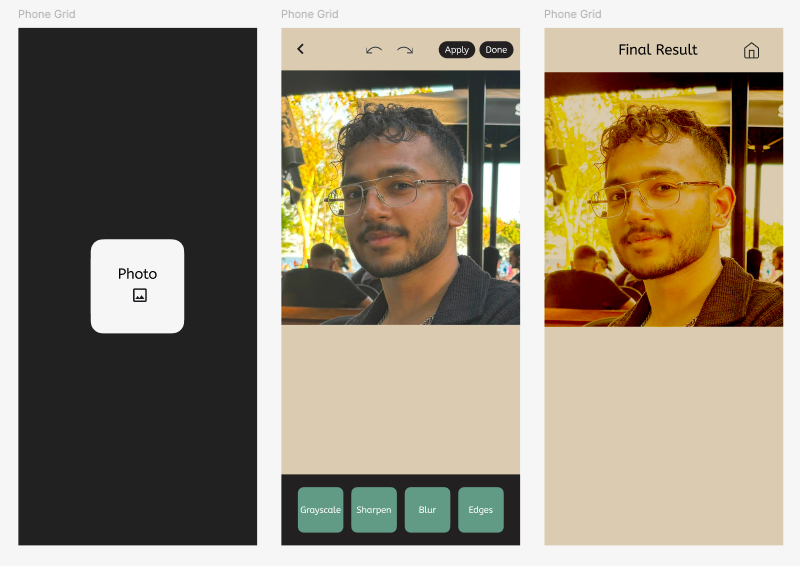

# Image-Filter-App
A simple Flutter app that runs image processing code natively using C++ for efficiency. Also includes a FastAPI backend to mock a cloud-based image processor.

<div style="text-align: center;">
    
</div>

## Plan

We'll have buttons for the different effects - not sliders - at the bottom 
We're gonna keep each folder very modular

1. CPP Image Processing 
  It's sole purpose is to create 3 different functions that take in an image and return an image with the filter applied to it
  Local Effects - Grayscale, Sharpen, Blur

2. Flutter Code
  Really the meat of the whole project.
  UX Flow:
    1. Select Image
    2. Apply Effects - 3 local + 1 through python (User can't tell them apart)
    3. Final Result Display Page
  
3. Mock API 
  REST API - Only one method that returns an edited image
  Meant to be a placeholder for a very computationally heavy filter that would be carried out on cloud
  Written in Python

## Setup

You can create a virtual environment if you don't wanna affect your host.

```
pip install -r requirements.txt
```
